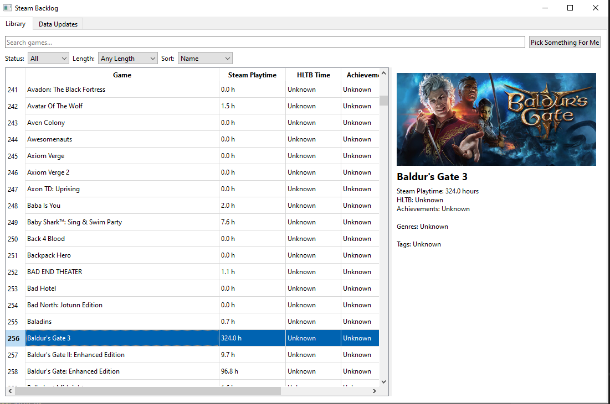

# Phase 2 — Clean up and Expansion - Current

So, Phase 2 was all about changing from JSON to SQLite and reorganizing the GUI.

As you could see, it looks a lot better.

## Moving to SQLite

SQLite replaced JSON as the main storage system.

The database is split into:
- Games
- Genres
- Tags
- Game/genre relationships
- Game/tag relationships

Because the project was still early, recreating the database was sometimes simpler than maintaining migrations for temporary structures. My time spent learning Oracle SQL was not wasted here, but it's not like I need a server or anything so some adjustments to SQLite was needed.

## Preventing Mixed Steam Libraries

Once the application began storing user-specific playtime and achievement information, another problem became obvious in hindsight and not being awake at 4 in the morning. If two people used the same database and entered different Steam IDs, their data could accidentally be mixed together. 

So, a small `database_info` table was added so the database can remember which SteamID64 owns it. Only one person can use their ID for any database, as once that call to steam was made it's kept in there. Only way to make a new database or add to it would be to delete the first database entirely.

## GUI Redesign

The original GUI worked, but almost every control was stacked vertically.

As more features were added, the actual game table kept getting pushed into a smaller part of the window. So, various redesigns had to happen. One being moving the code from main into the actual gui.py, which was something coming a while ago.

The interface was reorganized into tabs:
- Library
- Data Updates
- Settings

The Library tab now keeps the normal browsing controls together and gives most of the window to the game list.

Data Updates was for, obviously, updating the data. Still need to merge the three processes or, as I think I'm going with this, make each one a seperate thread processes.

Settings right now just allows you to clear the image cache and reset the local database. 

The selected game is shown beside the table instead of underneath everything.

## Selected Game Details

Selecting a game now shows more than its table row.

The details area can display:
- Steam artwork
- Game name
- Steam playtime
- HLTB estimate
- Achievement progress
- Genres
- Top tags

This makes the library much easier to browse without trying to fit every piece of information into table columns.

## Steam Artwork

Steam artwork was added without loading thousands of images at startup. I had the idea in the first phase but originally it would add the images alongside the steam API calls, but I figured no one really wanted all those pictures at once on loadup.

So, the images are loaded lazily then cached so that you didn't need to download the whole category of pictures for your library. 

# Future
This is it for Phase 2. Gonna dedicate the next phase to a worker system. So that should be fun.