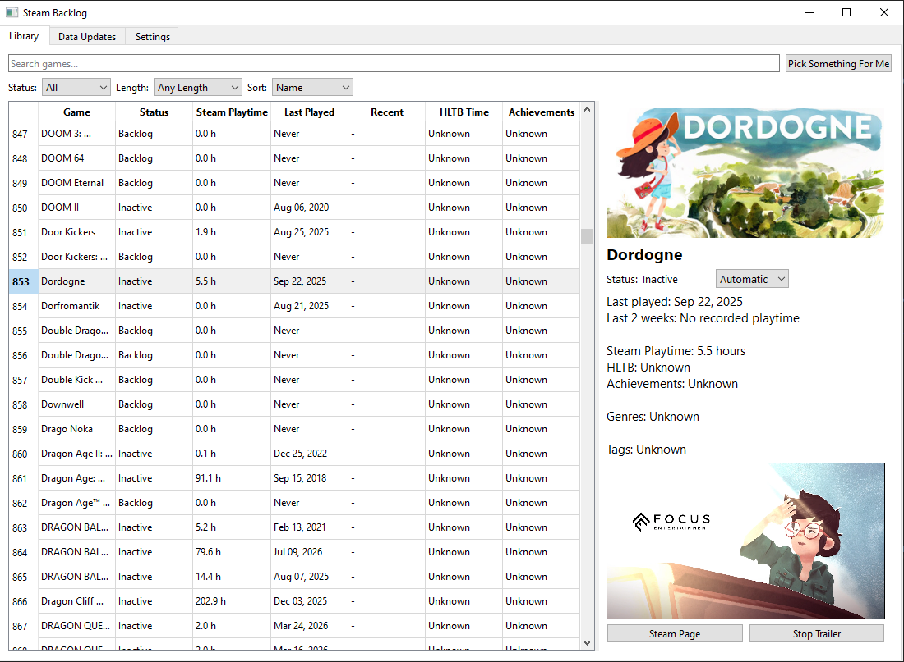

## Phase 2.5 - Library, Status, and UI Improvements

Before starting the threading work for Phase 3, I spent some time improving the main library screen and making better use of the Steam data already being collected after staring at the screen and realizing I had a lot of dead space on the details page.

This is what it looked like before as a reminder

# Status 

Steam comes with a last played date and recent two-week playtime. so with that, we could track to a degree and assign statuses on games so that people don't have to manually adjust everything from the get go.

Automatic statuses currently include:

- **Backlog** - no recorded playtime
- **Playing** - has recent Steam activity
- **Inactive** - has been played before, but not recently
- **Completed** - all available Steam achievements have been unlocked

Now obviously, this would never satistfy people. There are people who are "Complete" with a game after beating it the one time but there would be no way for anyone save you to be able to state when that is. But it's still a metric to follow.

Still, there are manual overrides for **Completed**, **On Hold**, and **Dropped**. Selecting **Automatic** returns the game to the normal inferred status. Manual statuses are saved in SQLite and survive Steam library refreshes.

# Library

The library table was expanded from four columns to show more useful information at a glance:

- Game
- Status
- Steam Playtime
- Last Played
- Recent Playtime
- HLTB Time
- Achievements

Filtering and sorting were updated to work with the new status and activity data as well.

The game details panel now shows the selected game's status, recent activity, last played date, playtime, HLTB estimate, achievements, genres, and SteamSpy tags.

# UI Improvements

Steam store integration was also expanded. There is now a button to open the selected game's Steam page, along with embedded trailer playback using Qt Multimedia. Trailer information is requested only when the user asks to watch one, rather than downloading video for the entire library.

Getting trailer playback working caused a few issues. Steam's current store data uses HLS and DASH streaming URLs, which required a bit of searching around a bit for that. Turns out HLS/H.264 works through Qt's FFmpeg backend, while the DASH streams I tested failed to open correctly, so DASH support is currently excluded. Direct MP4 or WebM links can still be used as fallbacks when Steam provides them. Bit of a time lag for having the trailer load but better for when you ask then downloading all the trailers for your whole library.

The Steam library refresh also needed an important fix. The original refresh approach could replace existing `Game` objects with newly downloaded Steam objects, which would throw away data already collected from HLTB, SteamSpy, achievements, or manual status changes. Refreshing now updates the Steam-specific fields on the existing objects instead.

I also spent some time improving window resizing. The original interface looked fine at its default size but left a large amount of unused space when maximized. Artwork and video were initially fixed-size as well, which caused problems when making the details panel smaller. The table, splitter, artwork, video, and details panel now resize more naturally with the window.

At this point the library screen is in a much better place for normal use. But one final problem came up as I tried testing things more seriously, or rather got reminded as I hadn't updated in a while.

# Sorting table improvement

One final performance issue showed up when testing the library with several thousand games. The original table used `QTableWidget`, which recreated thousands of `QTableWidgetItem` objects whenever the library was sorted. If you had, idk, 3,000 games and seven columns, that meant rebuilding more than 21,000 table items for a single sort assuming no filtering of course.

That had to be changed. I replaced that with Qt's model/view approach using `QTableView` and a custom `QAbstractTableModel`.

Instead of building a separate object for every cell, the table model keeps the existing list of `Game` objects and answers questions from the view as needed. For example, if Qt needs the text for the Status column on a particular row, the model looks up that game and returns `game.effective_status()`. If it needs the playtime column, it formats that game's playtime and returns the text.

Because the table is now reading directly from the game data instead of rebuilding thousands of cell objects after every sort, changing the sort order is effectively instant even with the full library visible.

The filtering and sorting logic itself did not need a large rewrite. The existing Python list can still be filtered or sorted, and the model is simply given the updated list. This keeps the rest of the GUI code mostly unchanged while making the table much more suitable for large Steam libraries.

tldr, we don't need 3000 individual entries any more that always need ot be stacked up, we can just look it up.