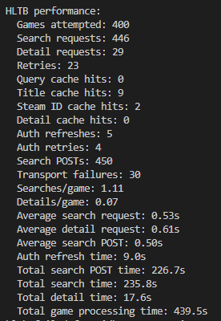

## Phase 3: External Data Infrastructure
Phase 3 turned the project from a mostly functional Steam library viewer into a more reliable large-library data pipeline.

Major changes included:

- moving external-data updates into background workers with progress, cancellation, and safer persistence
- replacing the slow large-library table setup with `QTableView` + `GameTableModel`
- making HLTB matching conservative, reviewable, and persistent
- adding exact HLTB-to-Steam identity checks using Steam App IDs from HLTB detail pages
- caching HLTB search/detail results and reusing HLTB session/auth state for much faster bulk updates
- adding official Steam app classification
- splitting the oversized GUI into separate library, updates, settings, controller, and table-model modules
- improving failure handling so temporary API problems do not silently become permanent bad data

Phase 3 is now considered the **external-data infrastructure / reliability phase**. Refresh policies, credentials/setup, staleness, filtering, and recommendation work should move into Phase 4.

---

## Large-Library UI

The library table was moved to:

- `QTableView`
- custom `GameTableModel`

This fixed major sorting/loading slowdown with a library of roughly 3,800 entries.

HLTB display also gained a selectable completion metric:

- Main Story
- Main + Extra
- Completionist
- All Styles

The selected metric is used consistently by:

- the library table
- sorting
- filtering
- game details
- random-game selection

---

## Background Update Architecture

External-data updates now run through background workers rather than performing long-running work on the GUI thread.

Workers are responsible for fetching data. Results are then applied and persisted through the application update layer.

Supported update sources include:

- Steam library data
- HLTB
- SteamSpy metadata
- achievements
- Steam classification

The update system now supports:

- real progress reporting
- cooperative cancellation
- incremental per-game saves where appropriate
- combined `Update Missing Data`
- individual source update actions
- preservation of previously valid data when an update fails

HLTB networking is intentionally kept serialized because concurrent HLTB requests caused noticeably more request failures and rate limiting.

---

## SteamSpy Reliability

Full-library testing exposed inconsistent SteamSpy responses.

Examples included:

- `genre` existing but being `null`
- `tags` arriving in unexpected formats
- transient JSON/request failures

Normalization and error handling were added so malformed or incomplete responses do not break database persistence.

---

## HLTB Matching and Review

The HLTB system was redesigned to prioritize correctness over aggressive fuzzy matching.

The current state model is:

```text
matched
review
no_match
pending
```

Similarity scores are used primarily for ranking Review candidates rather than proving that two titles are the same game.

Safe automatic title matching uses:

- normalized title equality
- equivalent normalized token sets
- HLTB aliases
- explicit known aliases

Common Steam/HLTB naming differences are handled through safe query cleanup, including:

- storefront/legal markers such as `™`, `®`, `©`, and `(TM)`
- `&` versus `and`
- edition/remaster suffixes
- trailing years
- Classic / Single Player labels
- Roman versus Arabic numbers
- limited punctuation/title-order variations

Broader queries may discover Review candidates, but they do not automatically prove identity.

The title matcher is now considered **FROZEN**. Remaining strange entries should normally be handled through exact identity checks, Steam classification, Review, or No Match rather than accumulating one-off regex rules.

---

## HLTB Review and Persistence

Ambiguous matches are persisted rather than discarded.

Each game may store:

- HLTB game ID
- HLTB page link
- HLTB completion times
- match status
- saved Review candidates

The Data Updates interface includes:

`Review HLTB Matches`

Review actions include:

- Accept Match
- No Match
- Skip
- Close Review

Saved candidates allow the Review UI to operate without repeating the original HLTB search.

Temporary request failures do not become permanent `no_match` results and remain retryable.

---

## HLTB Steam-ID Verification

A stronger identity fallback was added for difficult title matches.

New structure:

```text
api/
├── hltb_api.py
├── hltb_page.py
└── hltb_client.py
```

### `hltb_api.py`

Handles:

- query generation
- conservative title/alias matching
- Review candidate discovery
- process-lifetime caches
- exact Steam-ID verification
- retries
- performance diagnostics

### `hltb_page.py`

Fetches an HLTB game's detail page and reads its structured Next.js `__NEXT_DATA__`.

This can expose HLTB's associated Steam App ID.

Matching rule:

```text
same Steam App ID
    → safe automatic match

different Steam App ID
    → not enough evidence to reject
    → remain unresolved / Review

missing Steam App ID or page failure
    → remain unresolved / Review
```

This successfully resolves games whose Steam and HLTB names differ substantially without relying on fuzzy title similarity.

### `hltb_client.py`

Provides a persistent HLTB search transport.

It reuses:

- one `requests.Session`
- one User-Agent
- discovered HLTB search URL
- HLTB authentication state

The existing `howlongtobeatpy` result parser is retained.

This avoids repeating HLTB endpoint/auth discovery for every game search.

Testing showed the actual persistent-client search POST taking roughly:

```text
~0.5–0.6 seconds
```

compared with roughly:

```text
~2.5 seconds
```

for the older complete logical search path.

HLTB can still return `429 Too Many Requests`. Custom attempts to predict its reset timing were tested and removed. Final behavior keeps serialized searches, normal retry/backoff, and diagnostics without trying to reverse-engineer HLTB's rate-limit window.



A detailed technical explanation of this subsystem is kept separately in:

```text
reminders/HLTB_SYSTEM_REMINDER.md
```

---

## HLTB Caching

Process-lifetime caches were added for:

- exact search queries
- normalized HLTB titles
- normalized title-token forms
- known Steam-App-ID candidates
- HLTB detail-page Steam IDs

A search for one game can therefore cache useful candidates that may help resolve another game later.

Query ordering was also changed so likely HLTB-facing names are searched before noisy raw Steam storefront names.

---

## Official Steam Classification

Official Steam app classification was added using Valve's:

```text
IStoreService/GetAppList/v1/
```

Owned entries can now be classified as:

- `game`
- `software`
- `dlc`
- `video`
- `hardware`
- `unknown`

Classification is stored using:

- `steam_type`
- `classification_updated_at`

`unknown` deliberately does **not** mean non-game. Delisted, legacy, beta, or unusual App IDs may simply be absent from Steam's current catalog.

A manual:

```text
Refresh Steam Classification
```

action was added to the Data Updates tab.

Classification runs in the background and supports cancellation. New values are persisted only after a successful complete scan, preventing cancelled or failed runs from destroying valid existing classifications.

Steam library refresh also preserves previously collected:

- classification
- HLTB data
- metadata
- achievement data

The Library table now displays and sorts by Steam Type.

---

## GUI Refactor

As Phase 3 functionality expanded, `gui.py` became too large.

The UI was reorganized into:

```text
ui/
├── gui.py
├── library_tab.py
├── updates_tab.py
├── settings_tab.py
├── update_controller.py
└── game_table_model.py
```

Responsibilities are divided roughly as follows:

- `gui.py` - top-level coordination and application lifecycle
- `library_tab.py` - filters, table, details, statuses, artwork, trailers, and HLTB Review
- `updates_tab.py` - update controls and progress display
- `settings_tab.py` - account/cache/database controls
- `update_controller.py` - workers, update orchestration, progress, cancellation, and persistence
- `game_table_model.py` - table data, columns, display roles, and sorting

This was primarily an architectural refactor; the existing Steam, HLTB, SteamSpy, and achievement behavior was preserved.

---

## Additional Cleanup

Phase 3 also included smaller reliability/static-analysis fixes such as:

- Steam Type table sorting
- timezone-aware timestamp conversion
- model/default type cleanup
- worker error containment
- improved request diagnostics
- safer preservation of existing database values

---

## Phase 3 Final State

Phase 3 established the project's external-data infrastructure.

The application now has:

- responsive large-library table handling
- asynchronous external-data updates
- progress and cancellation
- incremental persistence
- safer failure handling
- reliable HLTB matching and manual Review
- exact Steam-ID HLTB verification
- cached and optimized HLTB searching
- persistent HLTB transport
- official Steam application classification
- reorganized UI/update architecture

Remaining unusual HLTB entries such as betas, multiplayer executables, mods, tutorials, software, old editions, and collections may legitimately remain Review or No Match.

Further work around refresh policies, data staleness, credentials/setup, filtering, and recommendations should move into a new phase rather than continuing to expand Phase 3.